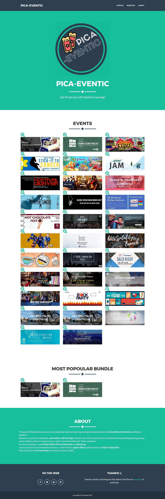

# PICA-EVENTIC
A prototype for LemonStand's potential machine learning feature.

The goal of thid prototype was to show potential machine learning and data mining features for LemonStand ecommerce software platform.
Between, ecommerce websites, association rule learning method is one of the most common machine learning methods being used as most retailers prefer to always have an extra recommendation for their customers.

For this prototype, I used Flask Python Microframework and Boostrap.
and for product recommendation feature, I used Python's apyori library which works on Apriori Algorithm.
Also the Data is real event data from future events at UBC.

#### Screenshot

